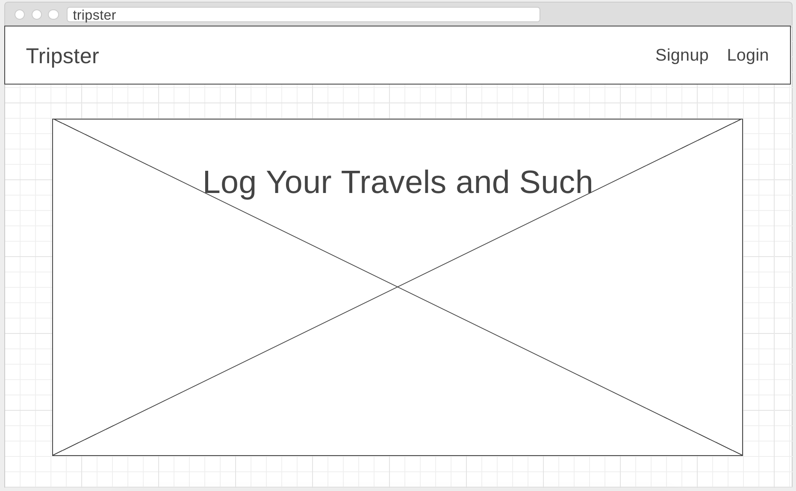
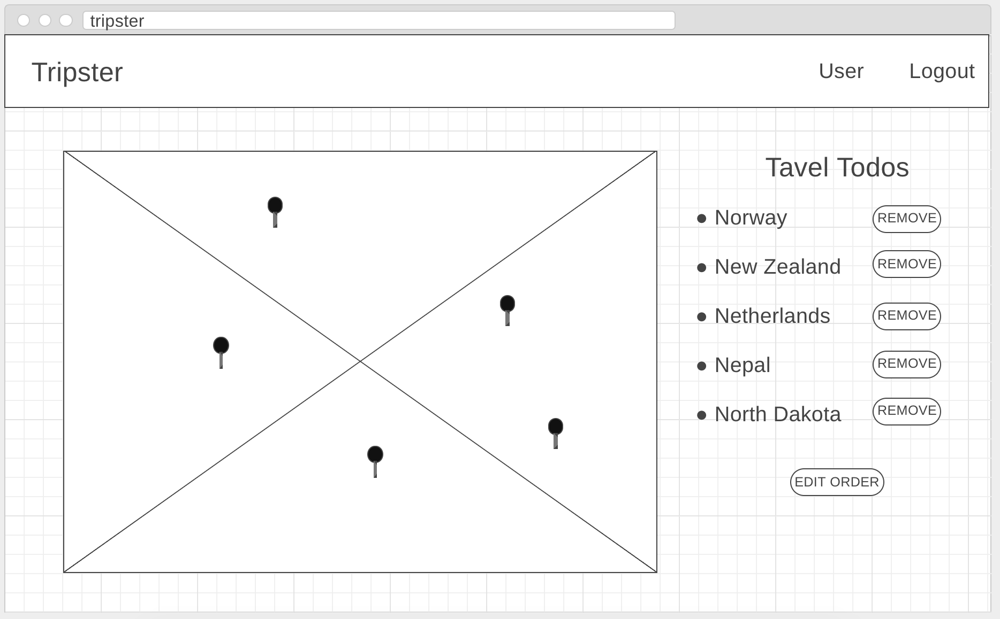

# **Tripster**

An app that will keep track of where a user would like to travel

[Check it out!](https://travel-todo.herokuapp.com/)

## What?
An app that allows a user to log in, keep track of places they've been and where they want to go.

## Wireframes

Landing Page   
Auth User Page    
 

## Chalenges

 - Mapbox 
 - Struggled with Heroku

## Resources Used

 - Mapbox API
 - Mongo DB
 - Bootstrap
 - Jquery

## Trello

[My Trello Board](https://trello.com/b/KgeJ0wYw/national-park-api)

<!-- ## Requirements
- [x] Render a game in the browser
- [x] Include two players (either two humans, or human and computer)
- [x] Design logic for winning & visually display which player won
- [x] Include separate HTML / CSS / JavaScript files
- [?] Stick with KISS (Keep It Simple Stupid) and DRY (Don't Repeat Yourself) principles
- [x] Use Javascript or jQuery for DOM manipulation
- [x] Deploy your game online, where the rest of the world can access it
- [?] Use semantic markup for HTML and CSS (adhere to best practices) -->